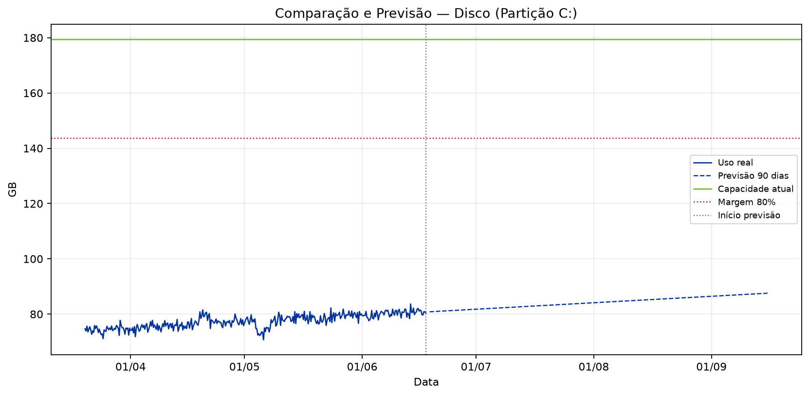
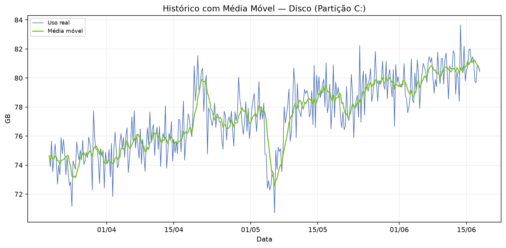
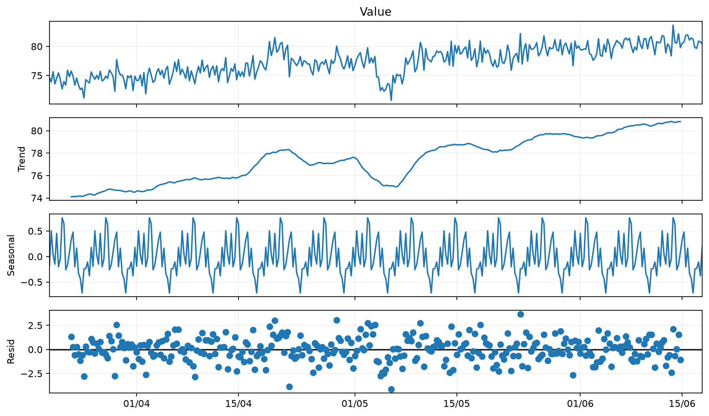
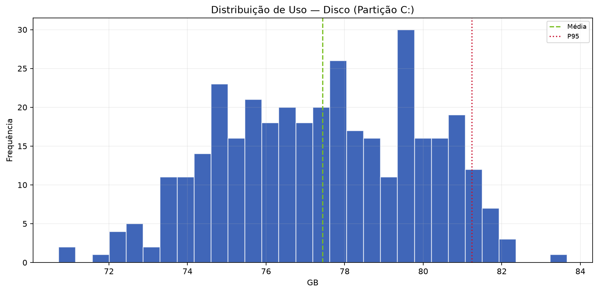
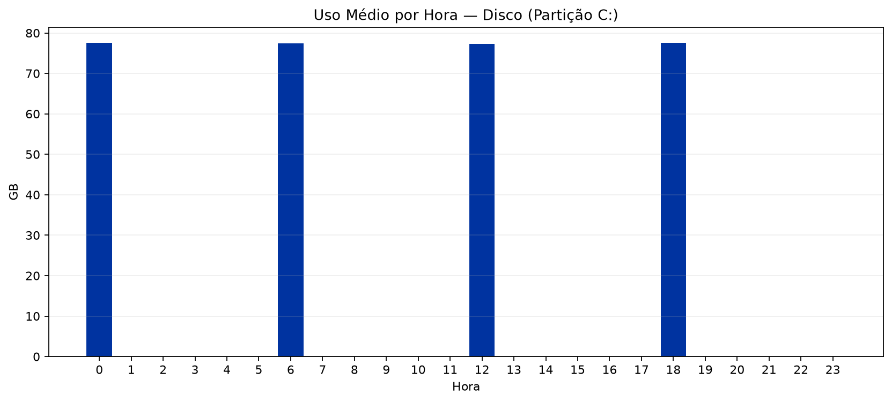

  
BV

  
Relatório de Análise Individual de Recursos — SRV-DASHPRD01

  
Classificação: <strong>PÚBLICO</strong>

# Relatório de Análise Individual de Recursos — SRV-DASHPRD01

| Campo | Valor |
|:--|:--|
| Solicitação | SOL178954 |
| Servidor / VM | SRV-DASHPRD01 |
| Recurso | Disco (Partição C:) |
| Período histórico | 90 dias |
| Período analisado | 20/03/2026 a 17/06/2026 |
| Analista | Francisco Alves |
| Origem dos dados | streamlit/local_simulado |
| Data de geração | 18/06/2026 23:13 |

---

## 1. Resumo Executivo

A análise do recurso Disco (Partição C:) da VM SRV-DASHPRD01 indica comportamento operacional estável. A capacidade atual é de 179.40 GB, o uso médio foi de 77.44 GB (43.16%) e o P95 ficou em 81.24 GB (45.28%), dentro da margem de segurança de 80%.

## 2. Análise Técnica dos Gráficos

O gráfico de comparação e previsão deve ser usado para verificar se a linha de utilização se aproxima da capacidade total ou da margem de segurança. O gráfico de média móvel ajuda a diferenciar picos isolados de tendência real. A decomposição da série temporal evidencia tendência, sazonalidade e resíduos. O histograma mostra onde o recurso permanece concentrado na maior parte do tempo, e o gráfico de uso por hora identifica janelas recorrentes de maior consumo.

### A. Comparação e Previsão

### B. Histórico com Média Móvel

### C. Decomposição da Série Temporal

### D. Distribuição de Uso

### E. Uso Médio por Hora

## 3. Análise Estatística

No período de 20/03/2026 a 17/06/2026, foram analisadas 360 amostras. A capacidade total considerada foi 179.40 GB e a margem de segurança de 80% equivale a 143.52 GB. Mínimo: 70.72 GB; média: 77.44 GB; mediana: 77.52 GB; P95: 81.24 GB; máximo: 83.66 GB. Previsões: 30 dias 83.04 GB (46.29%), 60 dias 85.30 GB (47.55%), 90 dias 87.57 GB (48.81%).

| Métrica | Valor |
|:--|--:|
| Capacidade total | 179.40 GB |
| Margem de segurança (80%) | 143.52 GB |
| Uso mínimo | 70.72 GB |
| Uso médio | 77.44 GB (43.16%) |
| Mediana | 77.52 GB (43.21%) |
| Q1 | 75.50 GB |
| Q3 | 79.55 GB |
| P95 | 81.24 GB (45.28%) |
| Uso máximo | 83.66 GB (46.63%) |
| Forecast 30 dias | 83.04 GB (46.29%) |
| Forecast 60 dias | 85.30 GB (47.55%) |
| Forecast 90 dias | 87.57 GB (48.81%) |
| Diagnóstico | OK |
| Ação recomendada | MANTER MONITORAMENTO |
| Capacidade sugerida | Não aplicável |
| Variação sugerida | Não aplicável |

## 4. Conclusão e Recomendação

Não há indicação de aumento imediato do recurso Disco (Partição C:). A recomendação é manter a configuração atual e continuar o monitoramento periódico.

## 5. Observações

- A LLM/Data+RAG não calcula os números: ela apenas transforma os indicadores calculados pelo motor estatístico em texto executivo.
- A margem de segurança usada foi de 80% da capacidade total.
- Forecast linear simples de 90 dias; usar como apoio, não como única fonte de decisão.

---

PÚBLICO
