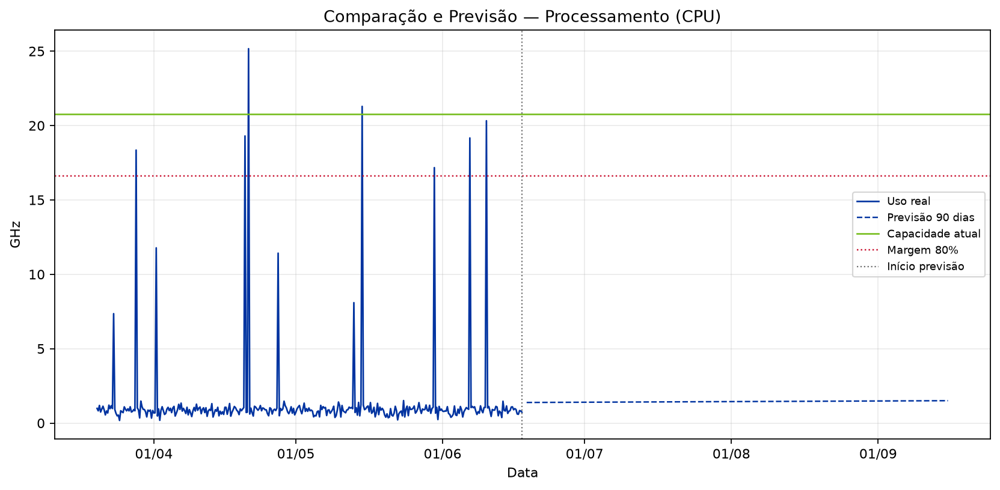
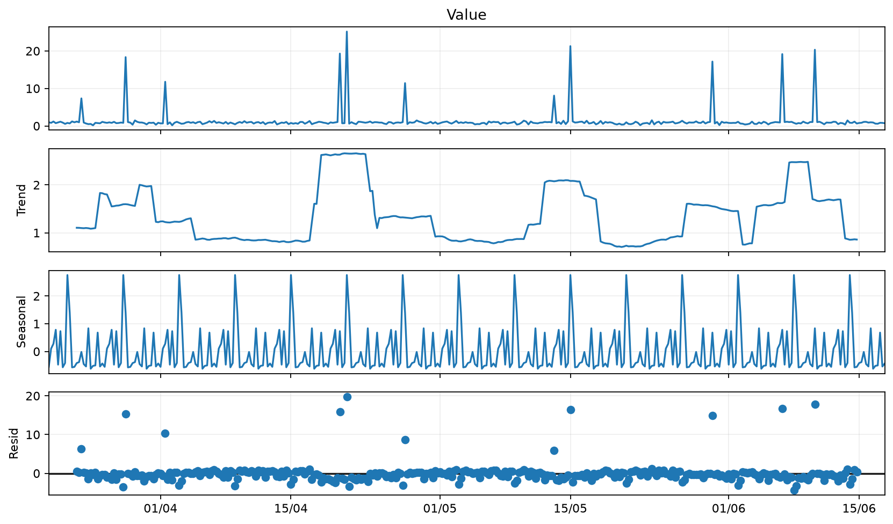
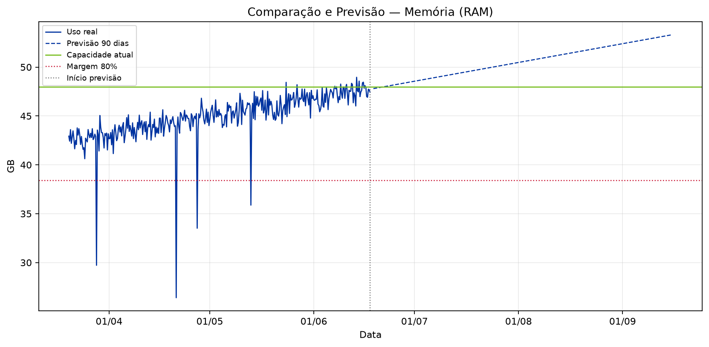
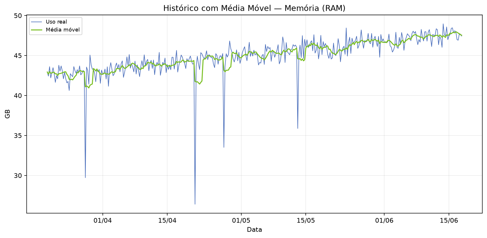
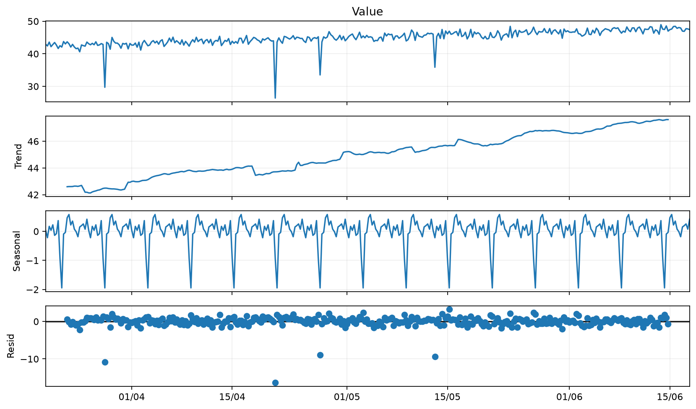
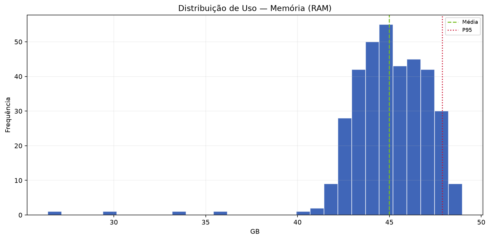
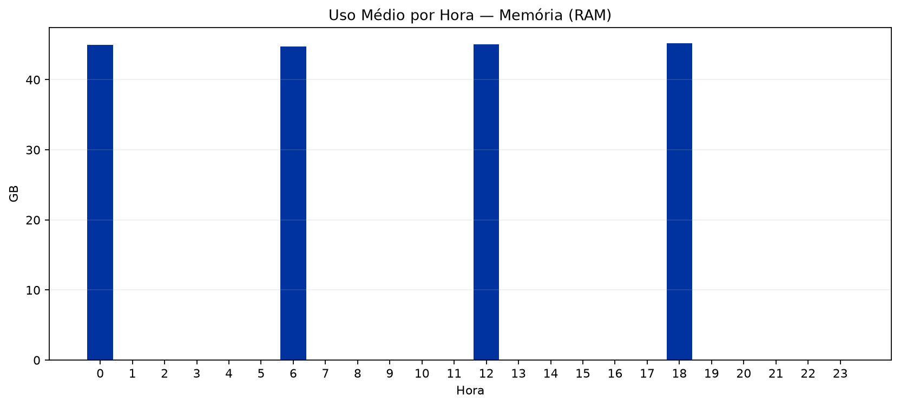

  
BV

  
Relatório Consolidado de Análise Individual de Recursos — SRV-DASHPRD01

  
Classificação: <strong>PÚBLICO</strong>

# Relatório Consolidado de Análise Individual de Recursos — SRV-DASHPRD01

| Campo | Valor |
|:--|:--|
| Solicitação | SOL178954 |
| Servidor / VM | SRV-DASHPRD01 |
| Período histórico | 90 dias |
| Analista | Francisco Alves |
| Classificação | PÚBLICO |
| Data de geração | 18/06/2026 23:13 |

## Índice

1. Resumo Executivo Consolidado
2. Análises por Recurso
   2.1. Processamento (CPU)
   2.2. Memória (RAM)
   2.3. Disco (Partição C:)
3. Observações

---

## 1. Resumo Executivo Consolidado

Foram avaliados 3 recurso(s) da VM **SRV-DASHPRD01** para a solicitação **SOL178954**. O ponto de maior atenção identificado foi **Processamento (CPU)**, com diagnóstico **SUPERDIMENSIONADO** e ação recomendada **AVALIAR_REDUÇÃO_RECURSO**.

| Recurso | Diagnóstico | Ação | Média | P95 | Forecast 90d | Capacidade sugerida |
|:--|:--|:--|--:|--:|--:|--:|
| Processamento (CPU) | SUPERDIMENSIONADO | AVALIAR REDUÇÃO | 6.37% | 6.63% | 7.25% | 10.00 GHz |
| Memória (RAM) | CRÍTICO | AUMENTAR RECURSO | 93.74% | 99.74% | 111.07% | 80.00 GB |
| Disco (Partição C:) | OK | MANTER MONITORAMENTO | 43.16% | 45.28% | 48.81% | Não aplicável |

## 2. Análises por Recurso

### 2.1. Processamento (CPU)

**Diagnóstico:** SUPERDIMENSIONADO  
**Ação recomendada:** AVALIAR REDUÇÃO  
**Uso médio:** 1.32 GHz (6.37%)  
**P95:** 1.38 GHz (6.63%)  
**Forecast 90 dias:** 1.50 GHz (7.25%)  

#### Resumo Executivo

A análise do recurso Processamento (CPU) da VM SRV-DASHPRD01 indica possível superdimensionamento. A capacidade atual é de 20.75 GHz, enquanto o uso médio foi de apenas 1.32 GHz (6.37%) e o P95 ficou em 1.38 GHz (6.63%). Não há evidência estatística de necessidade de aumento do recurso neste momento.

#### Análise Técnica dos Gráficos

O gráfico de comparação e previsão deve ser usado para verificar se a linha de utilização se aproxima da capacidade total ou da margem de segurança. O gráfico de média móvel ajuda a diferenciar picos isolados de tendência real. A decomposição da série temporal evidencia tendência, sazonalidade e resíduos. O histograma mostra onde o recurso permanece concentrado na maior parte do tempo, e o gráfico de uso por hora identifica janelas recorrentes de maior consumo.

##### A. Comparação e Previsão

##### B. Histórico com Média Móvel

##### C. Decomposição da Série Temporal

##### D. Distribuição de Uso

##### E. Uso Médio por Hora

#### Análise Estatística

No período de 20/03/2026 a 17/06/2026, foram analisadas 360 amostras. A capacidade total considerada foi 20.75 GHz e a margem de segurança de 80% equivale a 16.60 GHz. Mínimo: 0.18 GHz; média: 1.32 GHz; mediana: 0.87 GHz; P95: 1.38 GHz; máximo: 25.17 GHz. Previsões: 30 dias 1.42 GHz (6.86%), 60 dias 1.46 GHz (7.06%), 90 dias 1.50 GHz (7.25%).

| Métrica | Valor |
|:--|--:|
| Capacidade total | 20.75 GHz |
| Margem de segurança (80%) | 16.60 GHz |
| Uso mínimo | 0.18 GHz |
| Uso médio | 1.32 GHz (6.37%) |
| Mediana | 0.87 GHz (4.19%) |
| P95 | 1.38 GHz (6.63%) |
| Máximo | 25.17 GHz (121.28%) |
| Forecast 30 dias | 1.42 GHz (6.86%) |
| Forecast 60 dias | 1.46 GHz (7.06%) |
| Forecast 90 dias | 1.50 GHz (7.25%) |
| Capacidade sugerida | 10.00 GHz |
| Variação sugerida | -10.75 GHz |

#### Conclusão e Recomendação

Recomenda-se avaliar redução controlada do recurso Processamento (CPU), pois o uso médio e o P95 estão muito abaixo da capacidade alocada. Capacidade atual: 20.75 GHz. Capacidade técnica sugerida para avaliação: 10.00 GHz. A redução deve ser feita em janela controlada, com monitoramento após a alteração.

---

### 2.2. Memória (RAM)

**Diagnóstico:** CRÍTICO  
**Ação recomendada:** AUMENTAR RECURSO  
**Uso médio:** 44.99 GB (93.74%)  
**P95:** 47.88 GB (99.74%)  
**Forecast 90 dias:** 53.31 GB (111.07%)  

#### Resumo Executivo

A análise do recurso Memória (RAM) da VM SRV-DASHPRD01 indica cenário crítico de capacidade. O uso médio foi de 44.99 GB (93.74%), o P95 foi de 47.88 GB (99.74%) e a previsão de 90 dias aponta 53.31 GB (111.07%). O comportamento viola ou se aproxima fortemente da margem de segurança de 80%.

#### Análise Técnica dos Gráficos

O gráfico de comparação e previsão deve ser usado para verificar se a linha de utilização se aproxima da capacidade total ou da margem de segurança. O gráfico de média móvel ajuda a diferenciar picos isolados de tendência real. A decomposição da série temporal evidencia tendência, sazonalidade e resíduos. O histograma mostra onde o recurso permanece concentrado na maior parte do tempo, e o gráfico de uso por hora identifica janelas recorrentes de maior consumo.

##### A. Comparação e Previsão

##### B. Histórico com Média Móvel

##### C. Decomposição da Série Temporal

##### D. Distribuição de Uso

##### E. Uso Médio por Hora

#### Análise Estatística

No período de 20/03/2026 a 17/06/2026, foram analisadas 360 amostras. A capacidade total considerada foi 48.00 GB e a margem de segurança de 80% equivale a 38.40 GB. Mínimo: 26.41 GB; média: 44.99 GB; mediana: 45.09 GB; P95: 47.88 GB; máximo: 48.96 GB. Previsões: 30 dias 49.59 GB (103.32%), 60 dias 51.45 GB (107.19%), 90 dias 53.31 GB (111.07%).

| Métrica | Valor |
|:--|--:|
| Capacidade total | 48.00 GB |
| Margem de segurança (80%) | 38.40 GB |
| Uso mínimo | 26.41 GB |
| Uso médio | 44.99 GB (93.74%) |
| Mediana | 45.09 GB (93.93%) |
| P95 | 47.88 GB (99.74%) |
| Máximo | 48.96 GB (102.00%) |
| Forecast 30 dias | 49.59 GB (103.32%) |
| Forecast 60 dias | 51.45 GB (107.19%) |
| Forecast 90 dias | 53.31 GB (111.07%) |
| Capacidade sugerida | 80.00 GB |
| Variação sugerida | 32.00 GB |

#### Conclusão e Recomendação

Recomenda-se avaliar aumento do recurso Memória (RAM). Capacidade atual: 48.00 GB. Capacidade sugerida: 80.00 GB (variação estimada de 32.00 GB). A recomendação deve ser validada com o responsável da aplicação antes da alteração em produção.

---

### 2.3. Disco (Partição C:)

**Diagnóstico:** OK  
**Ação recomendada:** MANTER MONITORAMENTO  
**Uso médio:** 77.44 GB (43.16%)  
**P95:** 81.24 GB (45.28%)  
**Forecast 90 dias:** 87.57 GB (48.81%)  

#### Resumo Executivo

A análise do recurso Disco (Partição C:) da VM SRV-DASHPRD01 indica comportamento operacional estável. A capacidade atual é de 179.40 GB, o uso médio foi de 77.44 GB (43.16%) e o P95 ficou em 81.24 GB (45.28%), dentro da margem de segurança de 80%.

#### Análise Técnica dos Gráficos

O gráfico de comparação e previsão deve ser usado para verificar se a linha de utilização se aproxima da capacidade total ou da margem de segurança. O gráfico de média móvel ajuda a diferenciar picos isolados de tendência real. A decomposição da série temporal evidencia tendência, sazonalidade e resíduos. O histograma mostra onde o recurso permanece concentrado na maior parte do tempo, e o gráfico de uso por hora identifica janelas recorrentes de maior consumo.

##### A. Comparação e Previsão

##### B. Histórico com Média Móvel

##### C. Decomposição da Série Temporal

##### D. Distribuição de Uso

##### E. Uso Médio por Hora

#### Análise Estatística

No período de 20/03/2026 a 17/06/2026, foram analisadas 360 amostras. A capacidade total considerada foi 179.40 GB e a margem de segurança de 80% equivale a 143.52 GB. Mínimo: 70.72 GB; média: 77.44 GB; mediana: 77.52 GB; P95: 81.24 GB; máximo: 83.66 GB. Previsões: 30 dias 83.04 GB (46.29%), 60 dias 85.30 GB (47.55%), 90 dias 87.57 GB (48.81%).

| Métrica | Valor |
|:--|--:|
| Capacidade total | 179.40 GB |
| Margem de segurança (80%) | 143.52 GB |
| Uso mínimo | 70.72 GB |
| Uso médio | 77.44 GB (43.16%) |
| Mediana | 77.52 GB (43.21%) |
| P95 | 81.24 GB (45.28%) |
| Máximo | 83.66 GB (46.63%) |
| Forecast 30 dias | 83.04 GB (46.29%) |
| Forecast 60 dias | 85.30 GB (47.55%) |
| Forecast 90 dias | 87.57 GB (48.81%) |
| Capacidade sugerida | Não aplicável |
| Variação sugerida | Não aplicável |

#### Conclusão e Recomendação

Não há indicação de aumento imediato do recurso Disco (Partição C:). A recomendação é manter a configuração atual e continuar o monitoramento periódico.

---

## 3. Observações

- A LLM/Data+RAG não calcula os números: ela apenas transforma os indicadores calculados pelo motor estatístico em texto executivo.
- A margem de segurança usada foi de 80% da capacidade total.
- O relatório consolidado reúne as análises individuais em um único documento para facilitar anexos em solicitação, FUP ou comunicação executiva.

---

PÚBLICO