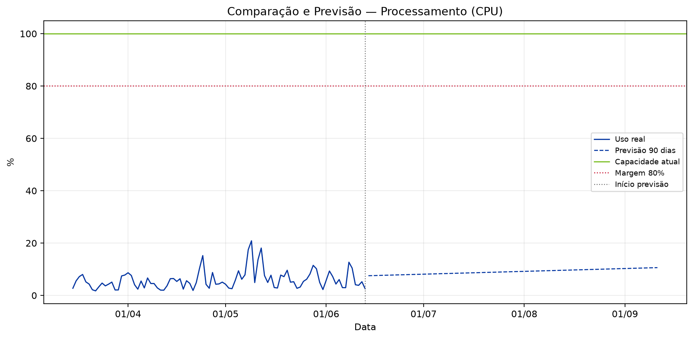
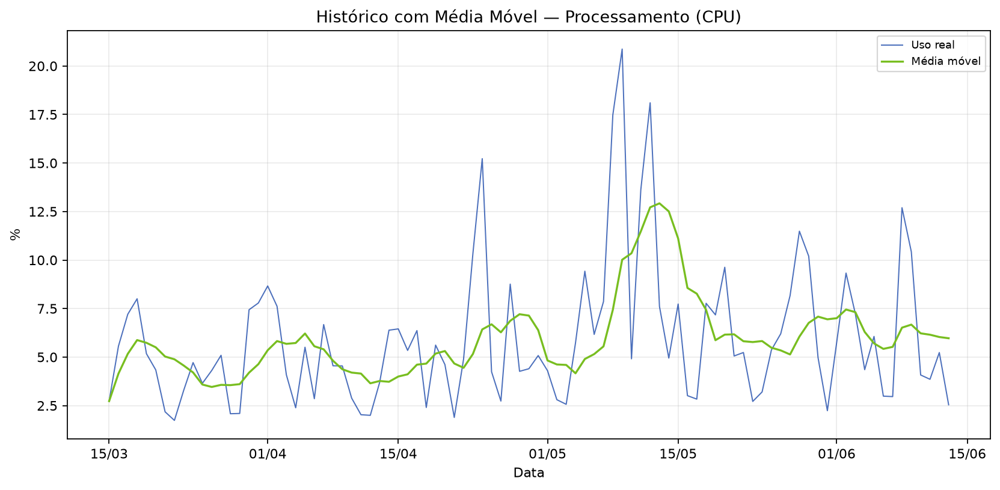
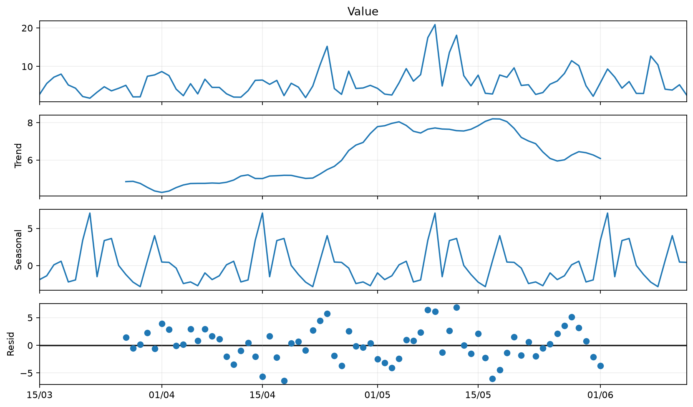
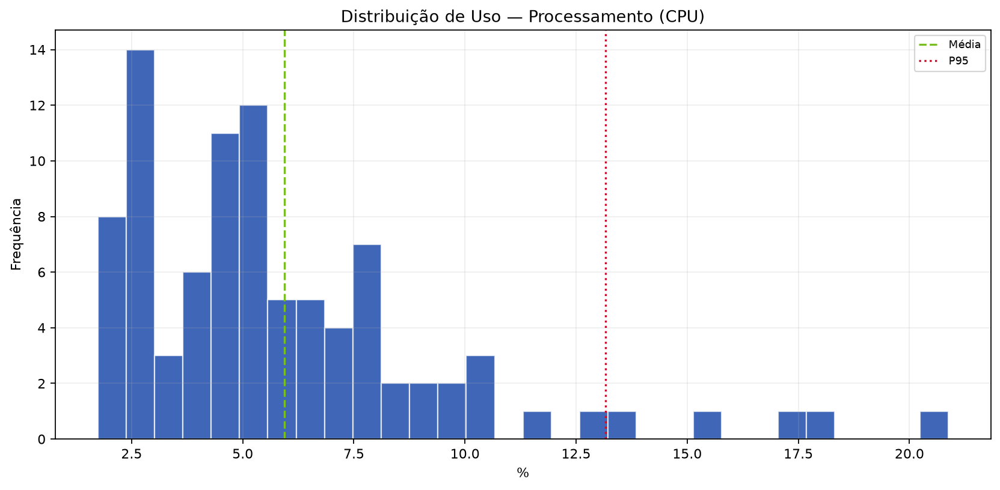
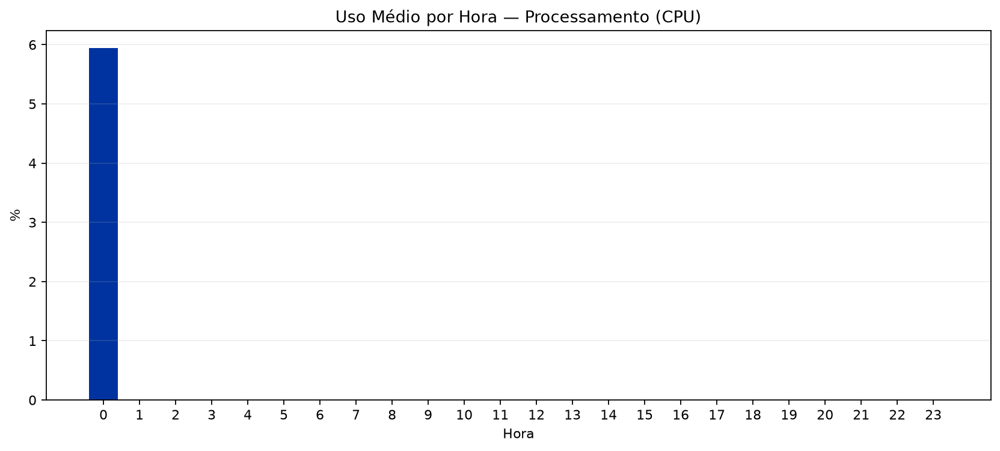

  
BV

  
Relatório de Análise Individual de Recursos — SRV-DASHPRD01

  
Classificação: <strong>PÊBLICO</strong>

# Relatório de Análise Individual de Recursos — SRV-DASHPRD01

| Campo | Valor |
|:--|:--|
| Solicitação | SOL1809645 |
| Servidor / VM | SRV-DASHPRD01 |
| Recurso | Processamento (CPU) |
| Período histórico | 90 dias |
| Período analisado | 15/03/2026 a 13/06/2026 |
| Solicitante | Eduardo Barbosa |
| Analista | Francisco Alves |
| Origem dos dados | DuckDB oficial / run_id=RMC_Recursos_VM_v5_10_4_4_3_20260615_130005 |
| Data de geração | 19/06/2026 17:12 |

---

## 1. Resumo Executivo

A análise do recurso Processamento (CPU) da VM SRV-DASHPRD01 indica possível superdimensionamento. A capacidade atual é de 100.00 %, enquanto o uso médio foi de apenas 5.94 % (5.94%) e o P95 ficou em 13.16 % (13.16%). Não há evidência estatística de necessidade de aumento do recurso neste momento.

## 2. Análise Técnica dos Gráficos

O gráfico de comparação e previsão deve ser usado para verificar se a linha de utilização se aproxima da capacidade total ou da margem de segurança. O gráfico de média móvel ajuda a diferenciar picos isolados de tendência real. A decomposição da série temporal evidencia tendência, sazonalidade e resíduos. O histograma mostra onde o recurso permanece concentrado na maior parte do tempo, e o gráfico de uso por hora identifica janelas recorrentes de maior consumo.

### A. Comparação e Previsão

### B. Histórico com Média Móvel

### C. Decomposição da Série Temporal

### D. Distribuição de Uso

### E. Uso Médio por Hora

## 3. Análise Estatística

No período de 15/03/2026 a 13/06/2026, foram analisadas 91 amostras. A capacidade total considerada foi 100.00 % e a margem de segurança de 80% equivale a 80.00 %. Mínimo: 1.74 %; média: 5.94 %; mediana: 5.08 %; P95: 13.16 %; máximo: 20.87 %. Previsões: 30 dias 8.54 % (8.54%), 60 dias 9.58 % (9.58%), 90 dias 10.62 % (10.62%).

| Métrica | Valor |
|:--|--:|
| Capacidade total | 100.00 % |
| Margem de segurança (80%) | 80.00 % |
| Uso mínimo | 1.74 % |
| Uso médio | 5.94 % (5.94%) |
| Mediana | 5.08 % (5.08%) |
| Q1 | 3.25 % |
| Q3 | 7.52 % |
| P95 | 13.16 % (13.16%) |
| Uso máximo | 20.87 % (20.87%) |
| Forecast 30 dias | 8.54 % (8.54%) |
| Forecast 60 dias | 9.58 % (9.58%) |
| Forecast 90 dias | 10.62 % (10.62%) |
| Diagnóstico | SUPERDIMENSIONADO |
| Ação recomendada | AVALIAR REDUÇÃO |
| Capacidade sugerida | 40.00 % |
| Variação sugerida | -60.00 % |

## 4. Conclusão e Recomendação

Recomenda-se avaliar redução controlada do recurso Processamento (CPU), pois o uso médio e o P95 estão muito abaixo da capacidade alocada. Capacidade atual: 100.00 %. Capacidade técnica sugerida para avaliação: 40.00 %. A redução deve ser feita em janela controlada, com monitoramento após a alteração.

## 5. Observações

- A LLM/Data+RAG não calcula os números: ela apenas transforma os indicadores calculados pelo motor estatístico em texto executivo.
- A margem de segurança usada foi de 80% da capacidade total.
- Forecast linear simples de 90 dias; usar como apoio, não como única fonte de decisão.

---

PÊBLICO
