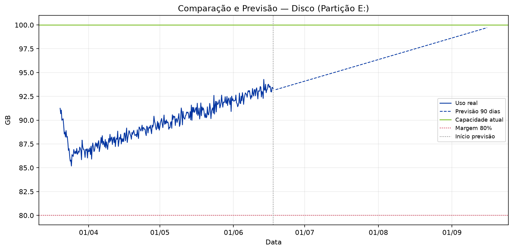
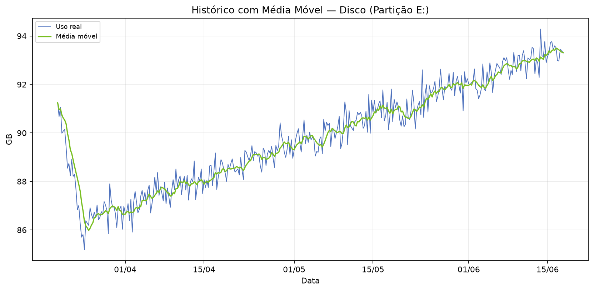
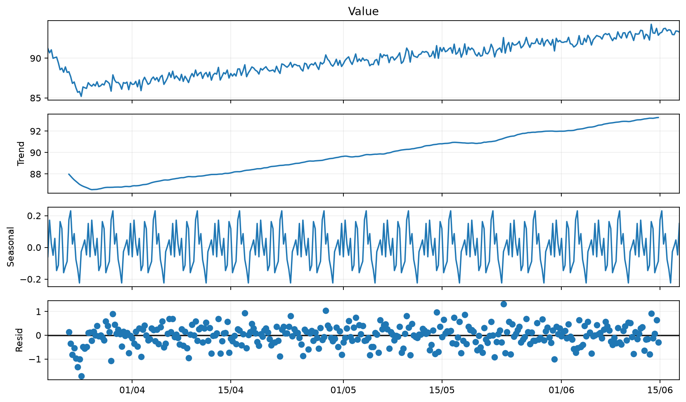
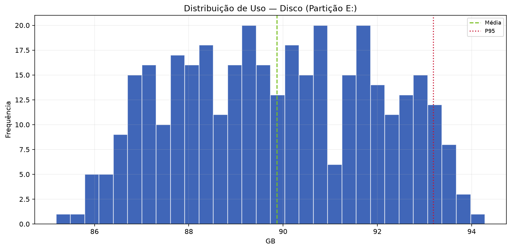
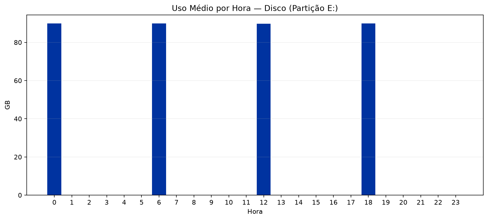

  
BV

  
Relatório de Análise Individual de Recursos — SRV-DASHPRD01

  
Classificação: <strong>PÚBLICO</strong>

# Relatório de Análise Individual de Recursos — SRV-DASHPRD01

| Campo | Valor |
|:--|:--|
| Solicitação | SOL1809645 |
| Servidor / VM | SRV-DASHPRD01 |
| Recurso | Disco (Partição E:) |
| Período histórico | 90 dias |
| Período analisado | 20/03/2026 a 17/06/2026 |
| Solicitante | Eduardo Barbosa |
| Analista | Francisco Alves |
| Origem dos dados | cli/local_simulado |
| Data de geração | 18/06/2026 23:11 |

---

## 1. Resumo Executivo

A análise do recurso Disco (Partição E:) da VM SRV-DASHPRD01 indica cenário crítico de capacidade. O uso médio foi de 89.87 GB (89.87%), o P95 foi de 93.19 GB (93.19%) e a previsão de 90 dias aponta 99.71 GB (99.71%). O comportamento viola ou se aproxima fortemente da margem de segurança de 80%.

## 2. Análise Técnica dos Gráficos

O gráfico de comparação e previsão deve ser usado para verificar se a linha de utilização se aproxima da capacidade total ou da margem de segurança. O gráfico de média móvel ajuda a diferenciar picos isolados de tendência real. A decomposição da série temporal evidencia tendência, sazonalidade e resíduos. O histograma mostra onde o recurso permanece concentrado na maior parte do tempo, e o gráfico de uso por hora identifica janelas recorrentes de maior consumo.

### A. Comparação e Previsão

### B. Histórico com Média Móvel

### C. Decomposição da Série Temporal

### D. Distribuição de Uso

### E. Uso Médio por Hora

## 3. Análise Estatística

No período de 20/03/2026 a 17/06/2026, foram analisadas 360 amostras. A capacidade total considerada foi 100.00 GB e a margem de segurança de 80% equivale a 80.00 GB. Mínimo: 85.18 GB; média: 89.87 GB; mediana: 89.85 GB; P95: 93.19 GB; máximo: 94.28 GB. Previsões: 30 dias 95.32 GB (95.32%), 60 dias 97.52 GB (97.52%), 90 dias 99.71 GB (99.71%).

| Métrica | Valor |
|:--|--:|
| Capacidade total | 100.00 GB |
| Margem de segurança (80%) | 80.00 GB |
| Uso mínimo | 85.18 GB |
| Uso médio | 89.87 GB (89.87%) |
| Mediana | 89.85 GB (89.85%) |
| Q1 | 88.14 GB |
| Q3 | 91.70 GB |
| P95 | 93.19 GB (93.19%) |
| Uso máximo | 94.28 GB (94.28%) |
| Forecast 30 dias | 95.32 GB (95.32%) |
| Forecast 60 dias | 97.52 GB (97.52%) |
| Forecast 90 dias | 99.71 GB (99.71%) |
| Diagnóstico | CRÍTICO |
| Ação recomendada | AUMENTAR RECURSO |
| Capacidade sugerida | 150.00 GB |
| Variação sugerida | 50.00 GB |

## 4. Conclusão e Recomendação

Recomenda-se avaliar aumento do recurso Disco (Partição E:). Capacidade atual: 100.00 GB. Capacidade sugerida: 150.00 GB (variação estimada de 50.00 GB). A recomendação deve ser validada com o responsável da aplicação antes da alteração em produção.

## 5. Observações

- A LLM/Data+RAG não calcula os números: ela apenas transforma os indicadores calculados pelo motor estatístico em texto executivo.
- A margem de segurança usada foi de 80% da capacidade total.
- Forecast linear simples de 90 dias; usar como apoio, não como única fonte de decisão.

---

PÚBLICO
