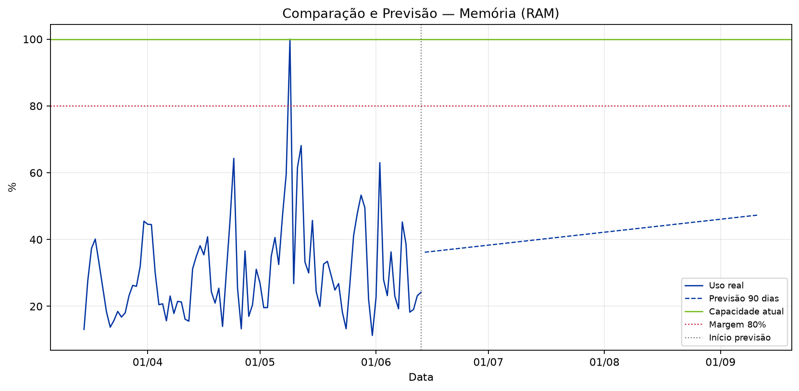
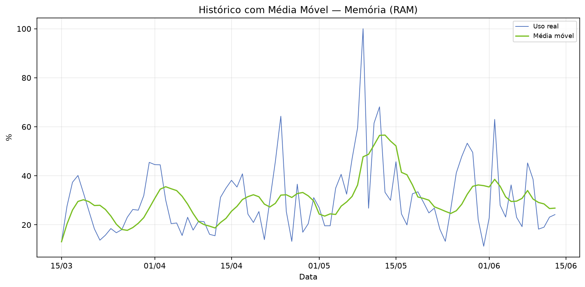
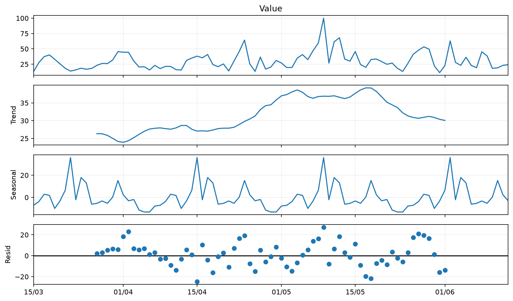
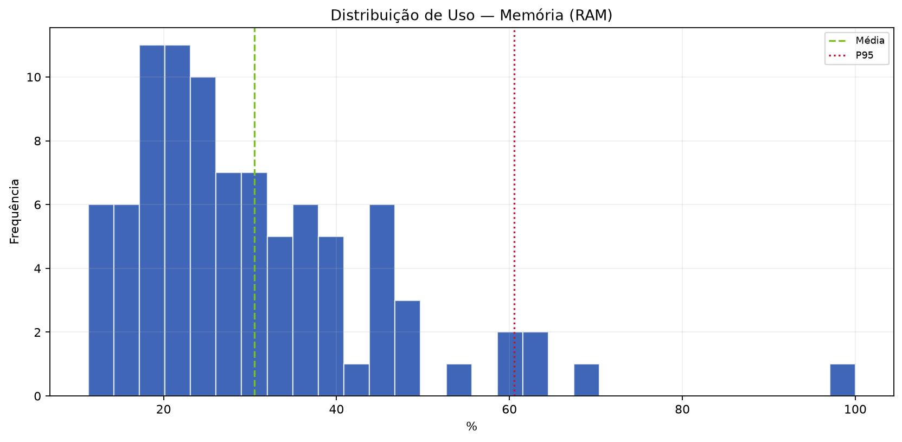
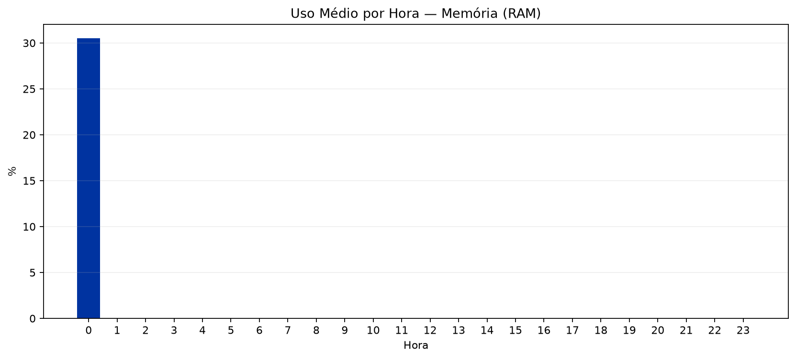

  
BV

  
Relatório de Análise Individual de Recursos — SRV-DASHPRD01

  
Classificação: <strong>PÊBLICO</strong>

# Relatório de Análise Individual de Recursos — SRV-DASHPRD01

| Campo | Valor |
|:--|:--|
| Solicitação | SOL1809645 |
| Servidor / VM | SRV-DASHPRD01 |
| Recurso | Memória (RAM) |
| Período histórico | 90 dias |
| Período analisado | 15/03/2026 a 13/06/2026 |
| Solicitante | Eduardo Barbosa |
| Analista | Francisco Alves |
| Origem dos dados | DuckDB oficial / run_id=RMC_Recursos_VM_v5_10_4_4_3_20260615_130005 |
| Data de geração | 19/06/2026 17:12 |

---

## 1. Resumo Executivo

A análise do recurso Memória (RAM) da VM SRV-DASHPRD01 indica comportamento operacional estável. A capacidade atual é de 100.00 %, o uso médio foi de 30.51 % (30.51%) e o P95 ficou em 60.55 % (60.55%), dentro da margem de segurança de 80%.

## 2. Análise Técnica dos Gráficos

O gráfico de comparação e previsão deve ser usado para verificar se a linha de utilização se aproxima da capacidade total ou da margem de segurança. O gráfico de média móvel ajuda a diferenciar picos isolados de tendência real. A decomposição da série temporal evidencia tendência, sazonalidade e resíduos. O histograma mostra onde o recurso permanece concentrado na maior parte do tempo, e o gráfico de uso por hora identifica janelas recorrentes de maior consumo.

### A. Comparação e Previsão

### B. Histórico com Média Móvel

### C. Decomposição da Série Temporal

### D. Distribuição de Uso

### E. Uso Médio por Hora

## 3. Análise Estatística

No período de 15/03/2026 a 13/06/2026, foram analisadas 91 amostras. A capacidade total considerada foi 100.00 % e a margem de segurança de 80% equivale a 80.00 %. Mínimo: 11.27 %; média: 30.51 %; mediana: 26.60 %; P95: 60.55 %; máximo: 100.00 %. Previsões: 30 dias 39.82 % (39.82%), 60 dias 43.57 % (43.57%), 90 dias 47.33 % (47.33%).

| Métrica | Valor |
|:--|--:|
| Capacidade total | 100.00 % |
| Margem de segurança (80%) | 80.00 % |
| Uso mínimo | 11.27 % |
| Uso médio | 30.51 % (30.51%) |
| Mediana | 26.60 % (26.60%) |
| Q1 | 20.22 % |
| Q3 | 36.97 % |
| P95 | 60.55 % (60.55%) |
| Uso máximo | 100.00 % (100.00%) |
| Forecast 30 dias | 39.82 % (39.82%) |
| Forecast 60 dias | 43.57 % (43.57%) |
| Forecast 90 dias | 47.33 % (47.33%) |
| Diagnóstico | OK |
| Ação recomendada | MANTER MONITORAMENTO |
| Capacidade sugerida | Não aplicável |
| Variação sugerida | Não aplicável |

## 4. Conclusão e Recomendação

Não há indicação de aumento imediato do recurso Memória (RAM). A recomendação é manter a configuração atual e continuar o monitoramento periódico.

## 5. Observações

- A LLM/Data+RAG não calcula os números: ela apenas transforma os indicadores calculados pelo motor estatístico em texto executivo.
- A margem de segurança usada foi de 80% da capacidade total.
- Forecast linear simples de 90 dias; usar como apoio, não como única fonte de decisão.

---

PÊBLICO
