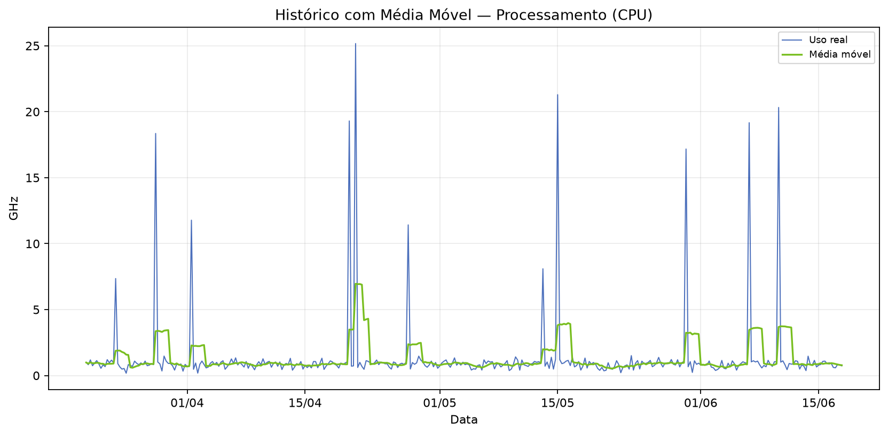
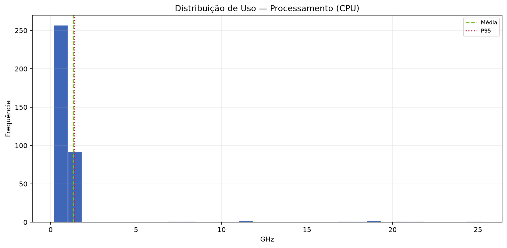
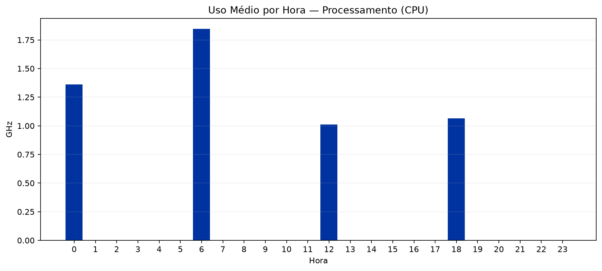

  
BV

  
Relatório de Análise Individual de Recursos — SRV-DASHPRD01

  
Classificação: <strong>PÚBLICO</strong>

# Relatório de Análise Individual de Recursos — SRV-DASHPRD01

| Campo | Valor |
|:--|:--|
| Solicitação | SOL185295 |
| Servidor / VM | SRV-DASHPRD01 |
| Recurso | Processamento (CPU) |
| Período histórico | 90 dias |
| Período analisado | 20/03/2026 a 17/06/2026 |
| Solicitante | Alberto Roberto |
| Analista | Francisco Alves |
| Origem dos dados | streamlit/local_simulado |
| Data de geração | 18/06/2026 23:46 |

---

## 1. Resumo Executivo

A análise do recurso Processamento (CPU) da VM SRV-DASHPRD01 indica possível superdimensionamento. A capacidade atual é de 20.75 GHz, enquanto o uso médio foi de apenas 1.32 GHz (6.37%) e o P95 ficou em 1.38 GHz (6.63%). Não há evidência estatística de necessidade de aumento do recurso neste momento.

## 2. Análise Técnica dos Gráficos

O gráfico de comparação e previsão deve ser usado para verificar se a linha de utilização se aproxima da capacidade total ou da margem de segurança. O gráfico de média móvel ajuda a diferenciar picos isolados de tendência real. A decomposição da série temporal evidencia tendência, sazonalidade e resíduos. O histograma mostra onde o recurso permanece concentrado na maior parte do tempo, e o gráfico de uso por hora identifica janelas recorrentes de maior consumo.

### A. Comparação e Previsão

### B. Histórico com Média Móvel

### C. Decomposição da Série Temporal

### D. Distribuição de Uso

### E. Uso Médio por Hora

## 3. Análise Estatística

No período de 20/03/2026 a 17/06/2026, foram analisadas 360 amostras. A capacidade total considerada foi 20.75 GHz e a margem de segurança de 80% equivale a 16.60 GHz. Mínimo: 0.18 GHz; média: 1.32 GHz; mediana: 0.87 GHz; P95: 1.38 GHz; máximo: 25.17 GHz. Previsões: 30 dias 1.42 GHz (6.86%), 60 dias 1.46 GHz (7.06%), 90 dias 1.50 GHz (7.25%).

| Métrica | Valor |
|:--|--:|
| Capacidade total | 20.75 GHz |
| Margem de segurança (80%) | 16.60 GHz |
| Uso mínimo | 0.18 GHz |
| Uso médio | 1.32 GHz (6.37%) |
| Mediana | 0.87 GHz (4.19%) |
| Q1 | 0.69 GHz |
| Q3 | 1.03 GHz |
| P95 | 1.38 GHz (6.63%) |
| Uso máximo | 25.17 GHz (121.28%) |
| Forecast 30 dias | 1.42 GHz (6.86%) |
| Forecast 60 dias | 1.46 GHz (7.06%) |
| Forecast 90 dias | 1.50 GHz (7.25%) |
| Diagnóstico | SUPERDIMENSIONADO |
| Ação recomendada | AVALIAR REDUÇÃO |
| Capacidade sugerida | 10.00 GHz |
| Variação sugerida | -10.75 GHz |

## 4. Conclusão e Recomendação

Recomenda-se avaliar redução controlada do recurso Processamento (CPU), pois o uso médio e o P95 estão muito abaixo da capacidade alocada. Capacidade atual: 20.75 GHz. Capacidade técnica sugerida para avaliação: 10.00 GHz. A redução deve ser feita em janela controlada, com monitoramento após a alteração.

## 5. Observações

- A LLM/Data+RAG não calcula os números: ela apenas transforma os indicadores calculados pelo motor estatístico em texto executivo.
- A margem de segurança usada foi de 80% da capacidade total.
- Forecast linear simples de 90 dias; usar como apoio, não como única fonte de decisão.

---

PÚBLICO
